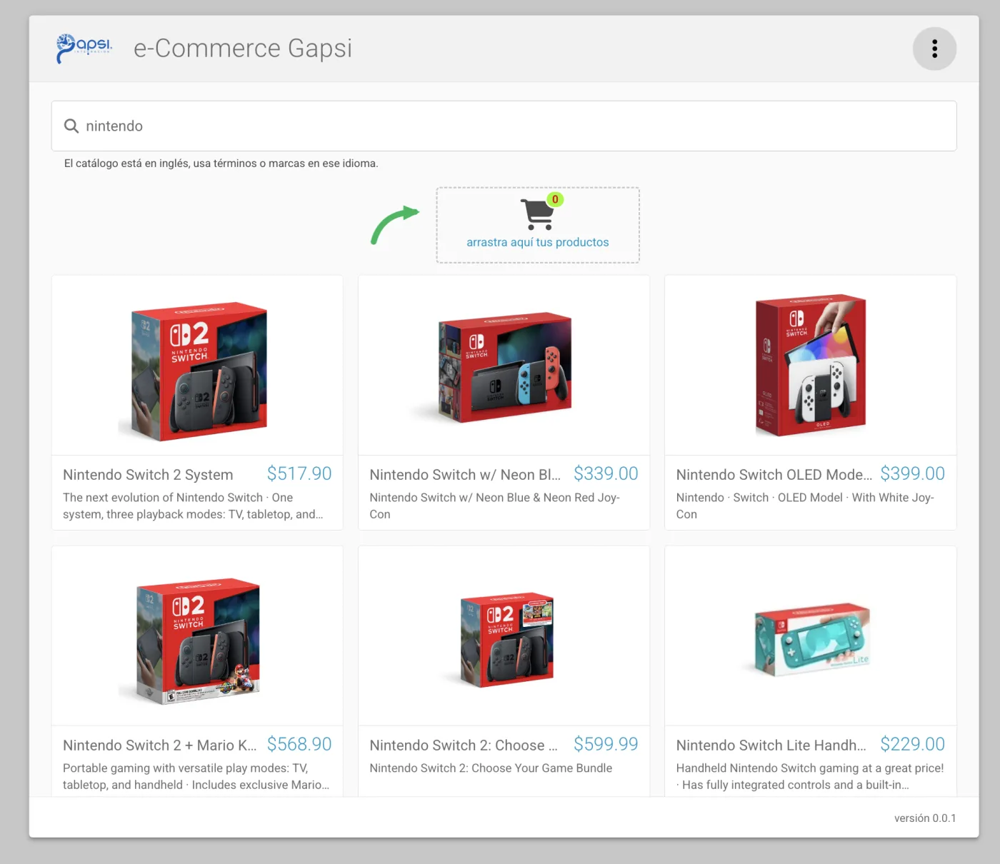

# e-Commerce Gapsi

Buscador de productos con carrito de compras por arrastre, construido con React 19,
TypeScript y Vite. Los productos se obtienen del servicio de búsqueda de Walmart
expuesto a través de RapidAPI.



---

## Puesta en marcha

### Requisitos

- **Node.js 20.19 o superior** (Vite 8 no arranca con versiones anteriores)
- npm 10 o superior

### Instalación

```bash
git clone <url-del-repositorio>
cd gapsi-e-commerce
npm install
npm run dev
```

La aplicación queda disponible en `http://localhost:5173`.

> **No hace falta configurar nada más.** El archivo `.env` viene incluido en el
> repositorio para que puedas clonar y ejecutar de inmediato. En la sección
> [Sobre la llave de API](#sobre-la-llave-de-api) se explica por qué.

### Scripts

| Script                 | Qué hace                                                   |
| ---------------------- | ---------------------------------------------------------- |
| `npm run dev`          | Servidor de desarrollo con recarga en caliente             |
| `npm run build`        | Compila TypeScript y genera el build minificado y ofuscado |
| `npm run preview`      | Sirve el build de producción localmente                    |
| `npm run lint`         | Analiza el código con ESLint                               |
| `npm run format`       | Aplica el formato de Prettier                              |
| `npm run format:check` | Verifica el formato sin modificar archivos                 |

Para depurar un build de producción sin ofuscar: `SIN_OFUSCAR=1 npm run build`.

### Variables de entorno

| Variable             | Descripción                                                      |
| -------------------- | ---------------------------------------------------------------- |
| `VITE_RAPIDAPI_KEY`  | Llave de suscripción a RapidAPI                                  |
| `VITE_RAPIDAPI_HOST` | Host del servicio (`axesso-walmart-data-service.p.rapidapi.com`) |

`.env.example` sirve de plantilla. La configuración se valida al arrancar y falla con
un mensaje claro si falta alguna variable.

> **Nota sobre las búsquedas:** el catálogo está en inglés. Usa términos como
> `nintendo`, `sony` o `computer`. El servicio tarda entre 20 y 40 segundos por
> página, así que la primera búsqueda puede sentirse lenta.

---

## Patrones de diseño

El examen pide implementar al menos dos patrones e indicar qué archivos los
representan. Se implementaron cinco, cada uno declarado en la cabecera de su archivo.

| Patrón                  | Archivo                         | Por qué                                                                                                                                 |
| ----------------------- | ------------------------------- | --------------------------------------------------------------------------------------------------------------------------------------- |
| **Adapter**             | `src/data/walmartAdapter.ts`    | Traduce la respuesta cruda del servicio al modelo `Product`. Aísla en un solo lugar todas las rarezas de un contrato que no controlamos |
| **Repository**          | `src/data/productRepository.ts` | Única puerta al origen de datos. El resto de la aplicación pide productos sin saber que detrás hay HTTP                                 |
| **Singleton**           | `src/graphql/apolloClient.ts`   | Una sola instancia de Apollo. La caché es estado compartido: dos clientes duplicarían la paginación                                     |
| **Provider / Observer** | `src/context/CartProvider.tsx`  | El carrito se publica una vez y cada componente interesado se suscribe con `useCart()`, sin pasar props por toda la jerarquía           |
| **Facade**              | `src/hooks/useProductSearch.ts` | Expone `products`, `loading` y `loadMore`. Los componentes no saben que detrás hay GraphQL                                              |

---

## Estructura del proyecto

```
config/                    Configuración del build, separada de vite.config.ts
  chunks.config.ts           Separación del bundle en fragmentos
  obfuscator.config.ts       Ofuscación del código propio
  pwa.config.ts              Manifiesto y estrategias de caché

src/
  config/                  Configuración de la aplicación
    api.config.ts            Endpoint, credenciales y límites del servicio
    theme.ts                 Tema de Material-UI con la paleta de Gapsi
    dndAccessibility.ts      Anuncios de arrastre para lectores de pantalla
  constants/               Valores del contrato del proveedor y de la retícula
  types/                   Tipos e interfaces compartidos
  data/                    Adapter y repositorio
  graphql/                 Schema, resolvers, consultas y cliente
  context/                 Estado del carrito (contexto + reducer)
  hooks/                   useProductSearch, useCart, useDebouncedValue, useGridColumns
  components/
    layout/                  Header, AppLayout, ResetButton
    search/                  SearchBar
    products/                ProductGrid, ProductCard, DraggableProductCard, ProductSkeleton
    cart/                    CartPanel, CartItem, GuideArrow
```

---

## Decisiones técnicas

### GraphQL sin backend

El examen pide implementar GraphQL, pero también que la solución sea exclusivamente
de front-end. En lugar de renunciar al requisito o montar un servidor aparte, el
schema se **ejecuta en el navegador**: Apollo Client resuelve las consultas contra un
schema ejecutable mediante `SchemaLink`, y los resolvers consultan el servicio REST a
través del repositorio.

La ventaja no es cosmética. La aplicación consume una sola consulta tipada y la caché
normalizada de Apollo se encarga de la paginación. El día que exista un backend real,
basta sustituir `SchemaLink` por `HttpLink` sin tocar componentes ni consultas.

El costo es que `graphql` y `@graphql-tools` son librerías pensadas para el servidor y
viajan completas al navegador: unos 186 KB del bundle.

### Dos formatos de precio

El servicio devuelve el precio de **dos maneras distintas y alterna entre ellas sin
aviso**. Se detectó porque la misma petición daba precios en una ejecución y ninguno en
la siguiente; muestreando seis respuestas seguidas, una usaba el segundo formato.

|                                       | Formato A           | Formato B                     |
| ------------------------------------- | ------------------- | ----------------------------- |
| `priceInfo.priceDetails.priceLines[]` | desglosado por tipo | **ausente**                   |
| `priceInfo.linePrice`                 | vacío               | `"$189.99"` (precio de venta) |
| `priceInfo.itemPrice`                 | vacío               | `"$212.99"` (precio anterior) |
| `price`                               | `0`                 | `189` (truncado a entero)     |

`walmartAdapter.ts` intenta A, cae a `linePrice`, luego a `itemPrice`, y deja el entero
truncado como último recurso. Sin esto, una de cada seis búsquedas mostraría todos los
productos sin precio.

### Deduplicación entre páginas

Páginas consecutivas del servicio repiten productos: entre la 1 y la 2 se repitieron
tres. La función `merge` de `apolloClient.ts` los filtra al concatenar. En una prueba,
tres páginas de 40 productos dieron 118 y no 120.

### Virtual scroll por filas

Se virtualizan **filas completas, no tarjetas sueltas**. La retícula tiene un número
conocido de columnas y las tarjetas altura fija, así que agrupar los productos en filas
permite tratarla como una lista y evita medir cada elemento.

Verificado: con 118 productos cargados, el DOM mantiene **24 tarjetas montadas** sin
importar la posición del scroll.

La carga incremental se apoya en el propio virtualizador en lugar de añadir un
observador de scroll aparte: cuando la última fila renderizada se acerca al final, se
pide la siguiente página.

### Ofuscación selectiva

Solo se ofuscan los fragmentos que contienen módulos de `src/`. Ofuscar React, MUI,
Apollo o GraphQL no protege nada —su código está publicado en npm— y llegaba a duplicar
el peso comprimido del bundle.

La ofuscación corre en el hook `renderChunk` y no en `generateBundle` porque el primero
se ejecuta **antes** de calcular el hash del nombre de archivo. De otro modo el
contenido cambia pero el nombre no, y navegadores y service worker seguirían sirviendo
la versión anterior indefinidamente.

|                   | Sin ofuscar | Final  |
| ----------------- | ----------- | ------ |
| Bundle crudo      | 870 KB      | 937 KB |
| Bundle comprimido | 263 KB      | 307 KB |

### Peso de los recursos

El logotipo, el favicon y el logotipo blanco se sirven en **WebP** en lugar de PNG:
31.9 KB a 4.4 KB, un **86 % menos**. Los mockups de referencia se movieron fuera de
`public/` para que no entren al build.

### Otras decisiones

- **Tipos centralizados** en `src/types/index.ts`, incluidas las props de los
  componentes, para que los contratos entre capas estén en un solo lugar.
- **Estado del carrito con Context y `useReducer`**, sin dependencias extra. La lógica
  vive en una función pura (`cartReducer.ts`) que se puede probar sin montar React.
- **Bootstrap se omitió** deliberadamente: es el requisito de menor peso y sus estilos
  globales compiten con los de Material-UI.
- **Descripciones convertidas a texto plano.** El servicio las entrega como HTML;
  además de dar un texto presentable, evita inyectar marcado ajeno en el DOM.

---

## Requisitos del examen

### Funcionales

| Requisito                                     | Peso | Dónde                                                                    |
| --------------------------------------------- | ---- | ------------------------------------------------------------------------ |
| Header con logo de Gapsi                      | 3    | `components/layout/Header.tsx`                                           |
| Búsqueda y listado de productos               | 5    | `components/search/SearchBar.tsx`, `components/products/ProductGrid.tsx` |
| Nombre, precio e imagen                       | 5    | `components/products/ProductCard.tsx`                                    |
| Carga de páginas al hacer scroll              | 5    | `ProductGrid.tsx` + `hooks/useProductSearch.ts`                          |
| Agregar al carrito arrastrando                | 5    | `components/cart/CartPanel.tsx`, `DraggableProductCard.tsx`              |
| Ocultar del listado lo que está en el carrito | 4    | `ProductGrid.tsx`                                                        |
| Botón de reinicio arriba a la derecha         | 3    | `components/layout/ResetButton.tsx`                                      |

### No funcionales

| Requisito                     | Peso | Dónde                                                         |
| ----------------------------- | ---- | ------------------------------------------------------------- |
| Virtual scroll                | 5    | `ProductGrid.tsx` con `@tanstack/react-virtual`               |
| Al menos 2 patrones de diseño | 4    | Cinco patrones, ver tabla arriba                              |
| Consumo del servicio web      | 5    | `data/productRepository.ts`                                   |
| Build minificado y ofuscado   | 3    | `config/obfuscator.config.ts`                                 |
| Drag & drop                   | 5    | `@dnd-kit/core`, con soporte de teclado                       |
| Al menos 1 feature de PWA     | 2    | `config/pwa.config.ts`: manifiesto instalable y caché offline |
| Material-UI                   | 4    | En toda la interfaz, con tema propio                          |
| GraphQL                       | 4    | `src/graphql/`                                                |
| Font Awesome desde CDN        | 2    | `index.html`                                                  |
| Bootstrap desde CDN           | 1    | No implementado (ver decisiones)                              |

---

## Accesibilidad

- El arrastre funciona **con teclado**: barra espaciadora para tomar el producto,
  flechas para moverlo, barra espaciadora para soltarlo, `Escape` para cancelar.
- Los anuncios para lectores de pantalla están traducidos al español
  (`config/dndAccessibility.ts`); dnd-kit los trae en inglés.
- Se respeta `prefers-reduced-motion`: todas las animaciones se neutralizan para quien
  lo tenga activado.
- Anillo de foco visible y uniforme en toda la aplicación.

---

## Sobre la llave de API

El `.env` con la llave está versionado a propósito, para que el evaluador pueda clonar
y ejecutar sin fricción.

Conviene ser explícito: en una aplicación 100 % de front-end **la llave viaja al
navegador de todas formas**. No existe manera de ocultarla sin un backend. En un
producto real la llamada viviría detrás de un BFF que guardara la credencial del lado
del servidor, y el navegador nunca la vería. Aquí se asume el compromiso porque la
llave es desechable y específica de esta prueba.

Un efecto secundario del diseño: como se envían los headers `x-rapidapi-*`, el navegador
obliga a una petición `OPTIONS` de verificación previa antes de cada búsqueda. Sumado a
la latencia del servicio, cada página cuesta dos viajes de ida y vuelta.

---

## Limitaciones conocidas

- **Iconos de la PWA reescalados.** El único recurso cuadrado disponible era de 32×32,
  así que `pwa-192.png` y `pwa-512.png` se generaron ampliándolo y se ven suaves.
  Conviene reemplazarlos por exportaciones a resolución nativa.
- **Diseño responsivo sin verificar en dispositivo.** Las reglas están implementadas
  (la retícula pasa a 2 y 1 columna en 900 px y 600 px), pero solo se probaron en
  escritorio.
- **Sin pruebas automatizadas.** La verificación fue manual y por instrumentación del
  DOM durante el desarrollo.

---

## Nota del candidato

Tengo experiencia previa trabajando con **Material-UI** y con **virtualización de
listas**, y ambas cosas agilizaron considerablemente el desarrollo: los componentes de
interfaz se armaron rápido, y decidir de entrada que había que virtualizar por filas
—en lugar de por tarjetas— evitó tener que rehacer la retícula al llegar la paginación.

Ese tiempo ganado se pudo dedicar a la capa de datos, que resultó ser la parte con más
aristas del ejercicio: el servicio alterna entre dos formatos de precio, mezcla
anuncios entre los productos, entrega las descripciones como HTML y repite elementos
entre páginas consecutivas.
